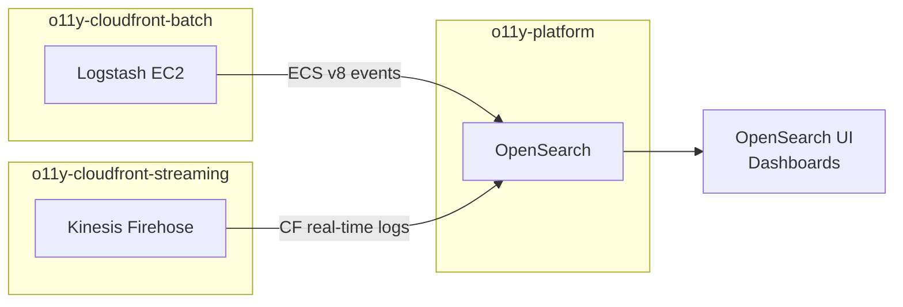

# Planetary Data Cloud (PDC) o11y-platform

Shared OpenSearch-backed observability platform for the Planetary Data Cloud. Aggregates logs from PDS services — batch node access logs via Logstash and CloudFront real-time logs via Kinesis Firehose.

## Architecture

OpenSearch is a shared platform — both o11y-cloudfront-batch and o11y-cloudfront-streaming write to it. Consumers discover the endpoint via SSM with no shared Terraform state between repos. See [`terraform/README.md`](terraform/README.md) for the full technical architecture and AWS resource details.

## Components

| Component | Path | Description |
|---|---|---|
| OpenSearch domain | `terraform/opensearch/` | Shared VPC-only OpenSearch cluster |

## Consumers

| Repo | What it writes |
|---|---|
| [o11y-cloudfront-batch](https://github.com/NASA-PDS/o11y-cloudfront-batch) | Parsed PDS node access logs (ECS v8) |
| [o11y-cloudfront-streaming](https://github.com/NASA-PDS/o11y-cloudfront-streaming) | CloudFront real-time log stream |

## First deployment

All deployments are driven by Terragrunt from `cds-infra-deploy`. The phases below must run in order; phases marked **(parallel)** can run simultaneously.

All commands run from a checkout of `cds-infra-deploy` using: `task plan VENUE=<venue> COMPONENT=<component>` and `task apply VENUE=<venue> COMPONENT=<component>`.

| Phase | What | Repo | IAM tier required |
|---|---|---|---|
| **0** | OpenSearch domain (consumers disabled; re-enabled in Phase 3) | [o11y-platform `terraform/opensearch/`](terraform/README.md) | PowerUser |
| **1a** *(parallel)* | Streaming IAM roles | [o11y-cloudfront-streaming `terraform/iam/`](https://github.com/NASA-PDS/o11y-cloudfront-streaming/blob/main/terraform/iam/README.md) | Admin (`iam:CreateRole`) |
| **1b** *(parallel)* | Batch IAM policies + S3 bucket | [o11y-cloudfront-batch `terraform/iam/policies/` + `terraform/s3/`](https://github.com/NASA-PDS/o11y-cloudfront-batch/blob/main/terraform/README.md) | Admin (`iam:CreatePolicy`) |
| **2a** | Streaming Kinesis/Firehose/Lambda | [o11y-cloudfront-streaming `terraform/`](https://github.com/NASA-PDS/o11y-cloudfront-streaming/blob/main/terraform/README.md) | PowerUser |
| **2b** | Logstash EC2 | [o11y-cloudfront-batch `terraform/logstash/`](https://github.com/NASA-PDS/o11y-cloudfront-batch/blob/main/terraform/README.md) | Admin (`iam:PassRole`) |
| **3** | Re-apply OpenSearch with both consumers enabled | [o11y-platform `terraform/opensearch/`](terraform/README.md) | PowerUser |
| **4** | CloudFront real-time log config + cache behaviors | [pdc-cds-infra `terraform/cloudfront/pds-main/`](https://github.com/NASA-PDS/pdc-cds-infra) | PowerUser |

Each phase publishes its outputs to SSM; the next phase reads them automatically at plan time — no manual parameter seeding needed.

See [`terraform/README.md`](terraform/README.md) for full deploy and upgrade instructions.

## Infrastructure

See [`terraform/README.md`](terraform/README.md) for deployment steps and Terraform module details.
