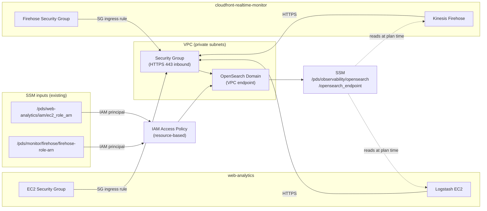
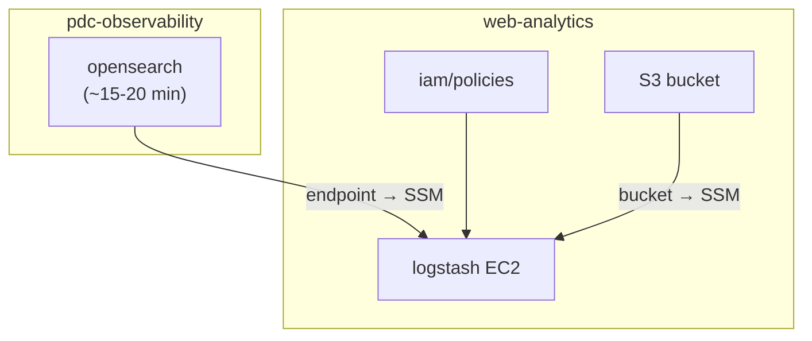

# PDS Observability — Terraform

Deploys the shared observability infrastructure for the NASA Planetary Data System. Consumers connect via SSM — no cross-repo Terraform dependencies.

## Technical architecture



Network access is controlled by Security Group ingress rules (EC2 SG and Firehose SG → port 443). API access is controlled by an IAM resource-based policy whose principals are role ARNs read from SSM at plan time. The endpoint is published to SSM after deploy; consumers read it at Terraform plan time (dashed lines) with no shared state between repos.

## Deployment flow



1. **(1a) Deploy OpenSearch** — `task opensearch:deploy VENUE=dev` (~15-20 min)
2. **(1b) While OpenSearch provisions**, run in parallel in `web-analytics`:
   - `task iam:deploy VENUE=dev` — attaches S3 + OpenSearch policy to the EC2 role
   - `task s3:deploy VENUE=dev` — creates the log bucket, publishes name to SSM
3. **(2) After all above complete** — `task logstash:deploy VENUE=dev` (in `web-analytics`) — reads OpenSearch endpoint and bucket name from SSM at plan time

---

## Prerequisites

- [Terraform](https://developer.hashicorp.com/terraform/downloads) >= 1.0
- [Task](https://taskfile.dev) — `brew install go-task/tap/go-task`
- AWS credentials exported:
  ```bash
  eval $(aws configure export-credentials --profile <your-profile> --format env)
  unset AWS_PROFILE  # required for Terraform S3 backend compatibility
  ```

---

## Setup

All tfvars are gitignored. Copy the example and fill in values:

```bash
cd terraform/

cp opensearch/tfvars/dev.tfvars.example opensearch/tfvars/dev.tfvars
# Edit dev.tfvars: set domain_name, vpc_id, vpc_subnet_ids, ec2_security_group_name, firehose_security_group_id
```

| Variable | Notes |
|---|---|
| `vpc_id`, `vpc_subnet_ids` | VPC where the OpenSearch endpoint is placed (private subnets) |
| `ec2_security_group_name` | MCP EC2 SG name — allows Logstash HTTPS inbound |
| `firehose_security_group_id` | CloudFront Firehose SG ID — allows Firehose HTTPS inbound |

If either consumer SSM parameter (`ec2_role_arn`, `firehose-role-arn`) doesn't exist yet, seed it manually before the first plan — see [Access control](#access-control).

---

## Deployment

### OpenSearch domain — 🔑 Power-User (~15-20 min)

```bash
cd terraform/

task opensearch:init    VENUE=dev
task opensearch:plan    VENUE=dev
task opensearch:deploy  VENUE=dev
task opensearch:endpoint VENUE=dev   # confirm endpoint stored in SSM
```

After deploy, the endpoint is published to SSM automatically:
```
/pds/observability/opensearch/opensearch_endpoint
```

---

## Access control

OpenSearch uses IAM resource-based access (no FGAC). Principals are read from SSM at plan time:

| SSM path | Published by |
|---|---|
| `/pds/web-analytics/iam/ec2_role_arn` | web-analytics `logstash` module on deploy |
| `/pds/monitor/firehose/firehose-role-arn` | cloudfront-realtime-monitor on deploy |

If a consumer hasn't deployed yet, seed the SSM parameter manually:

```bash
aws ssm put-parameter \
  --name /pds/web-analytics/iam/ec2_role_arn \
  --type String \
  --value "arn:aws:iam::<account-id>:role/<ec2-role-name>" \
  --overwrite

aws ssm put-parameter \
  --name /pds/monitor/firehose/firehose-role-arn \
  --type String \
  --value "arn:aws:iam::<account-id>:role/service-role/<firehose-role-name>" \
  --overwrite
```

---

## Teardown

```bash
task opensearch:destroy VENUE=dev   # destroys all indexed data — irreversible
```

---

## Architecture notes

- **State** — S3 backend, key `observability/opensearch.tfstate`.
- **VPC/SG values** are in tfvars. TODO: source EC2 SG from SSM under `/pds/cds-infra/vpc/security_groups/` once MCP publishes it.
- **Adding a new consumer** — publish its role ARN to SSM, add a `data "aws_ssm_parameter"` block in `opensearch/main.tf`, add the ARN to the access policy principals, and add an SG ingress rule if needed.
