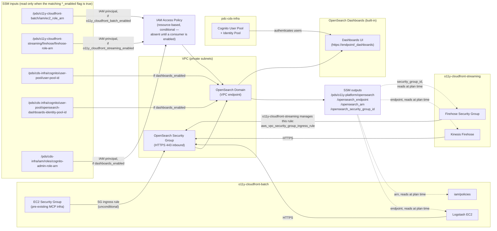
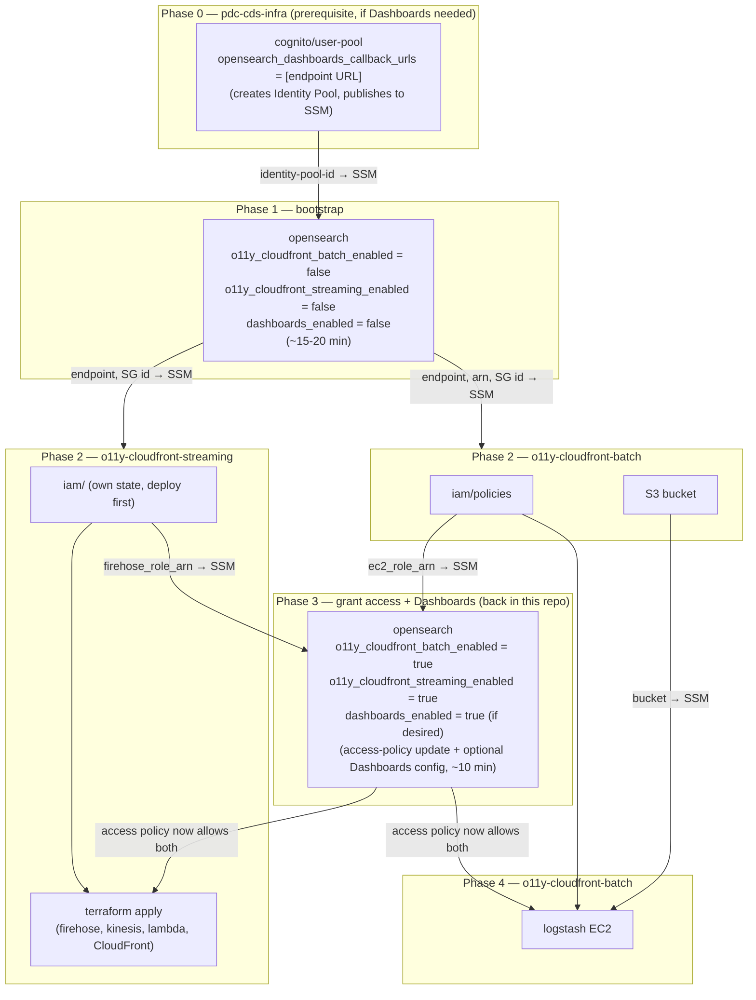

# PDS o11y-platform — Terraform

Deploys the shared observability infrastructure for the NASA Planetary Data System. Consumers connect via SSM — no cross-repo Terraform dependencies.

## Technical architecture



Network access is controlled by Security Group ingress rules (port 443). The EC2 SG rule lives here, since the MCP EC2 SG is pre-existing shared infra; the Firehose SG rule is instead created and owned by o11y-cloudfront-streaming itself, as a separate `aws_vpc_security_group_ingress_rule` resource targeting this repo's SG by ID (read from SSM) — this repo no longer takes a Firehose SG ID as an input. API access is controlled by an IAM resource-based policy whose principals are role ARNs read from SSM at plan time, gated by the `o11y_cloudfront_batch_enabled` / `o11y_cloudfront_streaming_enabled` / `dashboards_enabled` flags (see [Access control](#access-control)) so the domain can bootstrap before any consumer exists. The domain's endpoint, ARN, and security group ID are published to SSM after deploy; consumers read them at Terraform plan time (dashed lines) with no shared state between repos.

**OpenSearch Dashboards** is exposed natively when `dashboards_enabled = true`. It uses Cognito for authentication via resources provisioned in `pdc-cds-infra` (the shared infra layer). Users log in at `https://<opensearch-endpoint>/_dashboards`. See [Dashboards](#dashboards) for the enablement sequence.

## Deployment flow



0. **(0) pdc-cds-infra prerequisite (only needed for Dashboards)** — deploy `terraform/cognito/user-pool/` in [pdc-cds-infra](https://github.com/NASA-PDS/pdc-cds-infra) with `opensearch_dashboards_callback_urls` set to the expected Dashboards URL for the venue (`https://<opensearch-endpoint>/_dashboards/app/home`). This creates the `opensearch-dashboards` Identity Pool and publishes its ID to SSM. **If you don't need Dashboards yet, skip this phase entirely and leave `dashboards_enabled = false`.**
1. **(1) Bootstrap OpenSearch** — with all three flags `false` in tfvars: `task opensearch:deploy VENUE=dev` (~15-20 min). Publishes endpoint, ARN, and security group ID to SSM. The domain has **no access policy yet** at this point — that's expected.
2. **(2) Deploy both consumers** — each reads what it needs from SSM at plan time and can deploy immediately after step 1 completes, independently of the other:
   - `o11y-cloudfront-batch`: `task iam:deploy VENUE=dev` (publishes `ec2_role_arn`), then `task s3:deploy VENUE=dev`
   - `o11y-cloudfront-streaming`: `iam/` module first — own state, publishes `firehose_role_arn` — then the root module (creates the Firehose infra plus its own Firehose→OpenSearch security-group ingress rule, referencing this repo's SG ID from SSM)
   - Both `terraform apply`s in this phase succeed, but neither Logstash nor Firehose can actually reach the OpenSearch API yet — no access policy exists yet.
3. **(3) Grant access + enable Dashboards** — back in this repo, set `o11y_cloudfront_batch_enabled = true`, `o11y_cloudfront_streaming_enabled = true`, and optionally `dashboards_enabled = true` in tfvars, then re-run `task opensearch:deploy VENUE=dev`. With only the consumer flags this is access-policy-only (seconds). Adding `dashboards_enabled = true` also enables FGAC and wires Cognito — takes ~10 min, but is a config update, not a domain replacement. **⚠ Enabling FGAC (`dashboards_enabled = true`) is irreversible** — the domain must be destroyed and recreated to disable it.
4. **(4) Finish o11y-cloudfront-batch** — `task logstash:deploy VENUE=dev` — reads OpenSearch endpoint and bucket name from SSM at plan time.

No manual `aws ssm put-parameter` seeding is required anywhere in this flow — each side publishes what the other needs, and the `*_enabled` flags let this repo bootstrap before any consumer exists.

---

## Prerequisites

- [Terraform](https://developer.hashicorp.com/terraform/downloads) >= 1.10.0
- [Task](https://taskfile.dev) — `brew install go-task/tap/go-task`
- AWS credentials exported:
  ```bash
  eval $(aws configure export-credentials --profile <your-profile> --format env)
  unset AWS_PROFILE  # required for Terraform S3 backend compatibility
  ```

---

## Setup

tfvars are tracked in the `cds-infra-deploy` repo (private GitLab, not GitHub) at
`venues/<venue>/o11y-platform/opensearch.tfvars`, not in this repo — `*.tfvars` here is
gitignored. Point Task at a local checkout of that repo:

```bash
export CDS_INFRA_DEPLOY_DIR=/path/to/cds-infra-deploy
cd terraform/
task opensearch:plan VENUE=dev
```

For personal iteration before promoting values to `cds-infra-deploy`, pass `LOCAL=1` to use
this repo's own (gitignored) `opensearch/tfvars/<venue>.tfvars` instead:

```bash
cp opensearch/tfvars/dev.tfvars.example opensearch/tfvars/dev.tfvars
# Edit dev.tfvars: set domain_name, vpc_id, vpc_subnet_ids, ec2_security_group_name
task opensearch:plan VENUE=dev LOCAL=1
```

| Variable | Notes |
|---|---|
| `vpc_id`, `vpc_subnet_ids` | VPC where the OpenSearch endpoint is placed (private subnets) |
| `ec2_security_group_name` | MCP EC2 SG name — allows Logstash HTTPS inbound (pre-existing shared infra, unconditional) |
| `o11y_cloudfront_batch_enabled` | Set `false` for the initial bootstrap deploy; `true` once o11y-cloudfront-batch's `iam/policies` module has published `ec2_role_arn` — see [Access control](#access-control) |
| `o11y_cloudfront_streaming_enabled` | Set `false` for the initial bootstrap deploy; `true` once o11y-cloudfront-streaming's `iam/` module has published `firehose_role_arn` — see [Access control](#access-control) |
| `dashboards_enabled` | Set `false` initially; `true` once pdc-cds-infra `cognito/user-pool` has been deployed with the Dashboards callback URL — see [Dashboards](#dashboards). **Irreversible — enables FGAC permanently.** |

No Firehose SG ID input is needed — o11y-cloudfront-streaming creates its own ingress rule against this domain's SG (see [Technical architecture](#technical-architecture)).

---

## Deployment

### OpenSearch domain — 🔑 Power-User (~15-20 min)

```bash
cd terraform/

task opensearch:init    VENUE=dev
task opensearch:plan    VENUE=dev LOCAL=1
task opensearch:deploy  VENUE=dev LOCAL=1
task opensearch:endpoint             # confirm endpoint stored in SSM
```

After deploy, the endpoint, domain ARN, and security group ID are published to SSM automatically:
```
/pds/o11y-platform/opensearch/opensearch_endpoint
/pds/o11y-platform/opensearch/opensearch_arn
/pds/o11y-platform/opensearch/opensearch_security_group_id
```

See [Deployment flow](#deployment-flow) above for when to re-run this with `o11y_cloudfront_batch_enabled` / `o11y_cloudfront_streaming_enabled` set to `true`.

---

## Access control

Principals are read from SSM at plan time, each gated by a tfvars flag so this repo can bootstrap before any consumer exists. When `dashboards_enabled = true`, FGAC is also enabled on the domain (required by Cognito Dashboards auth).

| tfvars flag | SSM path (read only when flag is `true`) | Published by |
|---|---|---|
| `o11y_cloudfront_batch_enabled` | `/pds/o11y-cloudfront-batch/iam/ec2_role_arn` | o11y-cloudfront-batch `iam/policies` module |
| `o11y_cloudfront_streaming_enabled` | `/pds/o11y-cloudfront-streaming/firehose/firehose-role-arn` | o11y-cloudfront-streaming `iam/` module |
| `dashboards_enabled` | `/pds/cds-infra/iam/roles/cognito-admin-role-arn` | pdc-cds-infra `iam/roles` module |

All three default to `false`. With all false, `aws_opensearch_domain_policy` isn't created at all — an access policy with an empty `Principal.AWS` is invalid. The flags are independent; flip each as soon as the matching consumer or Cognito prereq is ready. See [Deployment flow](#deployment-flow) for the full sequence.

---

## Dashboards

OpenSearch Dashboards is exposed at `https://<opensearch-endpoint>/_dashboards` when `dashboards_enabled = true`. Users authenticate via the shared PDS Cognito User Pool managed in [pdc-cds-infra](https://github.com/NASA-PDS/pdc-cds-infra).

### Prerequisites

In pdc-cds-infra, deploy `terraform/cognito/user-pool/` with the venue-specific Dashboards callback URL:

```hcl
opensearch_dashboards_callback_urls = ["https://<opensearch-endpoint>/_dashboards/app/home"]
opensearch_dashboards_logout_urls   = ["https://<opensearch-endpoint>/_dashboards/app/home"]
```

This creates the `opensearch-dashboards` Cognito app client and Identity Pool, and publishes the Identity Pool ID to SSM at `/pds/cds-infra/cognito/user-pool/opensearch-dashboards-identity-pool-id`.

### Enabling Dashboards

Once the pdc-cds-infra Cognito resources exist, set `dashboards_enabled = true` in tfvars and apply:

```bash
task opensearch:plan   VENUE=dev
task opensearch:deploy VENUE=dev   # ~10 min — config update, not a domain replacement
```

This enables FGAC on the domain, attaches `cognito_options`, and creates an `es.amazonaws.com` IAM service role (`${domain_name}-opensearch-cognito`) with `AmazonOpenSearchServiceCognitoAccess`.

> **⚠ Irreversible:** Enabling FGAC cannot be undone. The domain must be destroyed and recreated to revert to non-FGAC mode. Only enable this once you intend it permanently for the venue.

### User management

Users are managed in pdc-cds-infra `terraform/cognito/user-and-groups/`. The Cognito admin role (`pds_cds_admin_through_cognito`) gets full Dashboards access by default via the FGAC master user ARN.

---

## Teardown

```bash
task opensearch:destroy VENUE=dev   # destroys all indexed data — irreversible
```

---

## Architecture notes

- **State** — S3 backend, key `o11y-platform/opensearch.tfstate`.
- **VPC/SG values** are in tfvars. TODO: source EC2 SG from SSM under `/pds/cds-infra/vpc/security_groups/` once MCP publishes it.
- **Adding a new consumer** — publish its role ARN to SSM, add a `data "aws_ssm_parameter"` block in `opensearch/main.tf`, add the ARN to the access policy principals, and add an SG ingress rule if needed.
