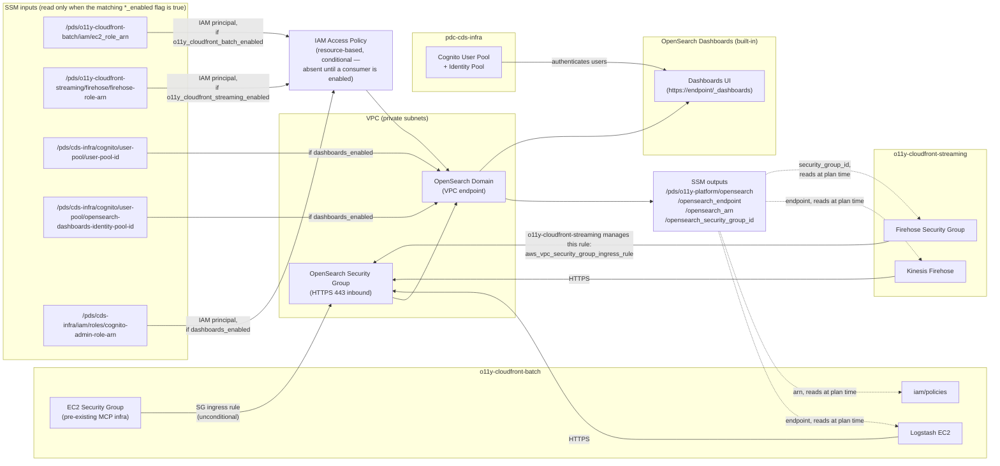
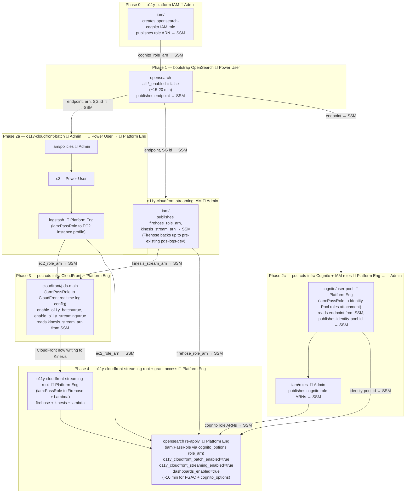

# PDS o11y-platform — Terraform

Deploys the shared observability infrastructure for the NASA Planetary Data System. Consumers connect via SSM — no cross-repo Terraform dependencies.

## Technical architecture



Network access is controlled by Security Group ingress rules (port 443). The EC2 SG rule lives here, since the MCP EC2 SG is pre-existing shared infra; the Firehose SG rule is instead created and owned by o11y-cloudfront-streaming itself, as a separate `aws_vpc_security_group_ingress_rule` resource targeting this repo's SG by ID (read from SSM) — this repo no longer takes a Firehose SG ID as an input. API access is controlled by an IAM resource-based policy whose principals are role ARNs read from SSM at plan time, gated by the `o11y_cloudfront_batch_enabled` / `o11y_cloudfront_streaming_enabled` / `dashboards_enabled` flags (see [Access control](#access-control)) so the domain can bootstrap before any consumer exists. The domain's endpoint, ARN, and security group ID are published to SSM after deploy; consumers read them at Terraform plan time (dashed lines) with no shared state between repos.

**OpenSearch Dashboards** is exposed natively when `dashboards_enabled = true`. It uses Cognito for authentication via resources provisioned in `pdc-cds-infra` (the shared infra layer). Users log in at `https://<opensearch-endpoint>/_dashboards`. See [Dashboards](#dashboards) for the enablement sequence.

## Required AWS permissions

Three access tiers are used across the full deployment. A given principal must have the highest tier required by all modules they deploy.

| Tier | Who | Required when |
|---|---|---|
| **Admin** | Ops/Admin SSO role with `iam:CreateRole` | Any IAM *creation* module — `iam/` submodules in this repo and all consumer repos |
| **Platform Engineer** | SSO role with `iam:PassRole` (but not `CreateRole`) | Any module that assigns an IAM role ARN to a non-IAM AWS resource (Firehose, Lambda, EC2 instance profile, CloudFront realtime log config, Cognito Identity Pool) |
| **Power User** | Standard `Project-Power-User` SSO | Everything else — OpenSearch bootstrap, S3, Kinesis, CloudWatch, SSM reads |

> `iam:PassRole` is **not** the same as `iam:CreateRole`. Modules that only *read* a role ARN from SSM and *assign* it to a service resource require PassRole but not CreateRole — these are Platform Engineer, not Admin.

## Deployment flow



0. **(0) o11y-platform IAM** 🔐 **Admin** — `task iam:deploy VENUE=dev`. Creates the `${domain_name}-opensearch-cognito` IAM service role (`iam:CreateRole`) and publishes its ARN to SSM. Only needed when `dashboards_enabled = true`.
1. **(1) Bootstrap OpenSearch** 👤 **Power User** — `task opensearch:deploy VENUE=dev` with all `*_enabled = false` (~15-20 min). Publishes endpoint, ARN, and SG ID to SSM. No IAM creation or role-passing at this phase.
2. **(2a/2b/2c) Deploy in parallel** — all three can start immediately after Phase 1:
   - **(2a) o11y-cloudfront-batch**: three sequential steps, each with a different access tier:
     - `iam/policies` — 🔐 **Admin** (`iam:CreatePolicy`, `iam:AttachRolePolicy`)
     - `s3` — 👤 **Power User** (creates `pds-dev-gh01dc-web-analytics` bucket)
     - `logstash` — 🔑 **Platform Engineer** (`iam:PassRole` to EC2 instance profile; publishes `ec2_role_arn` to SSM)
   - **(2b) o11y-cloudfront-streaming `iam/`** — 🔐 **Admin** (`iam:CreateRole` for Firehose/Lambda/CloudFront roles). Publishes `firehose_role_arn` and `kinesis_stream_arn` to SSM. Stop here — don't deploy the root module yet.
   - **(2c) pdc-cds-infra Cognito + IAM roles**: two sequential steps:
     - `cognito/user-pool` with `o11y_opensearch_dashboards_enabled = true` — 🔑 **Platform Engineer** (`iam:PassRole` to `aws_cognito_identity_pool_roles_attachment`; reads endpoint from SSM, publishes identity-pool-id to SSM)
     - `iam/roles` — 🔐 **Admin** (`iam:CreateRole` for Cognito-federated roles; publishes role ARNs to SSM)
3. **(3) pdc-cds-infra CloudFront** — 🔑 **Platform Engineer** — deploy `cloudfront/pds-main` with `enable_o11y_batch = true` and `enable_o11y_streaming = true`. Requires `iam:PassRole` because `aws_cloudfront_realtime_log_config` accepts a `role_arn` for CloudFront→Kinesis delivery. Reads `ec2_role_arn` and `kinesis_stream_arn` from SSM.
4. **(4) o11y-cloudfront-streaming root + grant OpenSearch access** — 🔑 **Platform Engineer** for both steps:
   - **o11y-cloudfront-streaming root** — requires `iam:PassRole` for `aws_kinesis_firehose_delivery_stream` and `aws_lambda_function` (both receive role ARNs read from SSM). Firehose reads from Kinesis → OpenSearch, backs up to `pds-logs-dev`.
   - **opensearch re-apply** — requires `iam:PassRole` for `cognito_options.role_arn`. Apply with `o11y_cloudfront_batch_enabled = true`, `o11y_cloudfront_streaming_enabled = true`, and `dashboards_enabled = true`. Consumer flags are access-policy-only (seconds); `dashboards_enabled` also wires `cognito_options` (~10 min). **⚠ Enabling FGAC is irreversible.**

**Two log buckets:**
- **`pds-logs-dev`** — pre-existing, managed by pdc-cds-infra. Receives CloudFront standard access logs and Firehose S3 backups.
- **`pds-dev-gh01dc-web-analytics`** — created by o11y-cloudfront-batch `s3`. Receives PDS node access logs read by Logstash.

No manual URL values or `aws ssm put-parameter` seeding required — everything is SSM-driven via `*_enabled` flags.

---

## Prerequisites

- [Terraform](https://developer.hashicorp.com/terraform/downloads) >= 1.10.0
- [Task](https://taskfile.dev) — `brew install go-task/tap/go-task`
- AWS credentials exported:
  ```bash
  eval $(aws configure export-credentials --profile <your-profile> --format env)
  unset AWS_PROFILE  # required for Terraform S3 backend compatibility
  ```

---

## Setup

tfvars are tracked in the `cds-infra-deploy` repo (private GitLab, not GitHub) at
`venues/<venue>/o11y-platform/opensearch.tfvars`, not in this repo — `*.tfvars` here is
gitignored. Point Task at a local checkout of that repo:

```bash
export CDS_INFRA_DEPLOY_DIR=/path/to/cds-infra-deploy
cd terraform/
task opensearch:plan VENUE=dev
```

For personal iteration before promoting values to `cds-infra-deploy`, pass `LOCAL=1` to use
this repo's own (gitignored) `opensearch/tfvars/<venue>.tfvars` instead:

```bash
cp opensearch/tfvars/dev.tfvars.example opensearch/tfvars/dev.tfvars
# Edit dev.tfvars: set domain_name, vpc_id, vpc_subnet_ids, ec2_security_group_name
task opensearch:plan VENUE=dev LOCAL=1
```

| Variable | Notes |
|---|---|
| `vpc_id`, `vpc_subnet_ids` | VPC where the OpenSearch endpoint is placed (private subnets) |
| `ec2_security_group_name` | MCP EC2 SG name — allows Logstash HTTPS inbound (pre-existing shared infra, unconditional) |
| `o11y_cloudfront_batch_enabled` | Set `false` for the initial bootstrap deploy; `true` once o11y-cloudfront-batch's `iam/policies` module has published `ec2_role_arn` — see [Access control](#access-control) |
| `o11y_cloudfront_streaming_enabled` | Set `false` for the initial bootstrap deploy; `true` once o11y-cloudfront-streaming's `iam/` module has published `firehose_role_arn` — see [Access control](#access-control) |
| `dashboards_enabled` | Set `false` initially; `true` once pdc-cds-infra `cognito/user-pool` has been deployed with the Dashboards callback URL — see [Dashboards](#dashboards). **Irreversible — enables FGAC permanently.** |

No Firehose SG ID input is needed — o11y-cloudfront-streaming creates its own ingress rule against this domain's SG (see [Technical architecture](#technical-architecture)).

---

## Deployment

### OpenSearch domain bootstrap — 👤 Power User (~15-20 min)

```bash
cd terraform/

task opensearch:init    VENUE=dev
task opensearch:plan    VENUE=dev LOCAL=1
task opensearch:deploy  VENUE=dev LOCAL=1
task opensearch:endpoint             # confirm endpoint stored in SSM
```

After deploy, the endpoint, domain ARN, and security group ID are published to SSM automatically:
```
/pds/o11y-platform/opensearch/opensearch_endpoint
/pds/o11y-platform/opensearch/opensearch_arn
/pds/o11y-platform/opensearch/opensearch_security_group_id
```

See [Deployment flow](#deployment-flow) above for when to re-run this with `o11y_cloudfront_batch_enabled` / `o11y_cloudfront_streaming_enabled` set to `true`.

---

## Access control

Principals are read from SSM at plan time, each gated by a tfvars flag so this repo can bootstrap before any consumer exists. When `dashboards_enabled = true`, FGAC is also enabled on the domain (required by Cognito Dashboards auth).

| tfvars flag | SSM path (read only when flag is `true`) | Published by |
|---|---|---|
| `o11y_cloudfront_batch_enabled` | `/pds/o11y-cloudfront-batch/iam/ec2_role_arn` | o11y-cloudfront-batch `iam/policies` module |
| `o11y_cloudfront_streaming_enabled` | `/pds/o11y-cloudfront-streaming/firehose/firehose-role-arn` | o11y-cloudfront-streaming `iam/` module |
| `dashboards_enabled` | `/pds/cds-infra/iam/roles/cognito-admin-role-arn` | pdc-cds-infra `iam/roles` module |

All three default to `false`. With all false, `aws_opensearch_domain_policy` isn't created at all — an access policy with an empty `Principal.AWS` is invalid. The flags are independent; flip each as soon as the matching consumer or Cognito prereq is ready. See [Deployment flow](#deployment-flow) for the full sequence.

---

## Dashboards

OpenSearch Dashboards is exposed at `https://<opensearch-endpoint>/_dashboards` when `dashboards_enabled = true`. Users authenticate via the shared PDS Cognito User Pool managed in [pdc-cds-infra](https://github.com/NASA-PDS/pdc-cds-infra).

### Prerequisites

First, complete the Phase 1 bootstrap deploy so the OpenSearch endpoint is in SSM. Then in pdc-cds-infra, deploy `terraform/cognito/user-pool/` with `o11y_opensearch_dashboards_enabled = true` — it reads the endpoint from SSM at `/pds/o11y-platform/opensearch/opensearch_endpoint` and constructs the callback URL automatically. No manual URL values needed.

### Enabling Dashboards

Once the pdc-cds-infra Cognito resources exist (Identity Pool ID in SSM), set `dashboards_enabled = true` in tfvars and apply:

```bash
task opensearch:plan   VENUE=dev
task opensearch:deploy VENUE=dev   # ~10 min — config update, not a domain replacement
```

This enables FGAC on the domain, attaches `cognito_options`, and creates an `es.amazonaws.com` IAM service role (`${domain_name}-opensearch-cognito`) with `AmazonOpenSearchServiceCognitoAccess`.

> **⚠ Irreversible:** Enabling FGAC cannot be undone. The domain must be destroyed and recreated to revert to non-FGAC mode. Only enable this once you intend it permanently for the venue.

### User management

Users are managed in pdc-cds-infra `terraform/cognito/user-and-groups/`. The Cognito admin role (`pds_cds_admin_through_cognito`) gets full Dashboards access by default via the FGAC master user ARN.

---

## OpenSearch UI Application

The **OpenSearch UI Application** is a separately AWS-hosted web UI — distinct from the built-in `/_dashboards` endpoint. It connects to the VPC-only domain without requiring a public endpoint, supports multiple data sources and workspaces, and is the AWS-recommended path for authenticated ops access going forward.

> **No Terraform resource exists yet** — `aws_opensearch_application` is tracked in [hashicorp/terraform-provider-aws#45082](https://github.com/hashicorp/terraform-provider-aws/issues/45082). The steps below are manual (console + CLI). The VPC authorization step (one CLI call) can optionally be added as a `null_resource` local-exec in the `opensearch/` module once the pattern is stable.

### Auth options

Two authentication modes are supported. Choose one when creating the application:

| Mode | When to use | Requirements |
|---|---|---|
| **IAM auth** (default) | Ops personnel already have IAM roles; access via AWS console | No additional setup — IAM role ARNs are granted directly |
| **IAM Identity Center** | SSO login without requiring AWS console access; broader audience | IAM Identity Center must be enabled in the account/org first |

### Prerequisites

Complete [Phase 1 (OpenSearch bootstrap)](#opensearch-domain-bootstrap----power-user-15-20-min) so the domain exists. No `dashboards_enabled` or Cognito setup is required for the OpenSearch UI Application.

### Step 1 — Authorize VPC access (CLI) — 🔑 Platform Engineer

After the domain exists, authorize the OpenSearch UI service to reach it through the VPC:

```bash
aws opensearch authorize-vpc-endpoint-access \
  --domain-name <domain-name> \
  --service application.opensearchservice.amazonaws.com \
  --region us-west-2
```

This is a one-time authorization per domain. To verify:

```bash
aws opensearch list-vpc-endpoint-access \
  --domain-name <domain-name> \
  --region us-west-2
```

### Step 2 — Create the application (console)

1. Open **Amazon OpenSearch Service → OpenSearch UI (Dashboards) → Create application**
2. Enter an **Application name** (e.g., `pds-dev-o11y-ui`)
3. Choose your auth mode:

**IAM auth (no Identity Center):**
- Leave the **Authentication with IAM Identity Center** box unchecked
- Under **OpenSearch application admins**, choose **Grant administrator's permission to specific user(s)**
- Select **IAM users** or pick the IAM role ARN(s) for your ops SSO roles
- Choose **Create**

**IAM Identity Center (SSO):**
- Check **Authentication with IAM Identity Center**
- If IDC is already enabled, the existing instance is detected automatically
- If not, create an account instance via the prompt (for testing) or request an org instance
- Create or select an **IAM role for Identity Center application** (see trust policy below)
- Add admin users/groups from your IDC directory
- Choose **Create**

**IAM role trust policy required for IAM Identity Center auth:**
```json
{
  "Version": "2012-10-17",
  "Statement": [
    {
      "Effect": "Allow",
      "Principal": { "Service": "application.opensearchservice.amazonaws.com" },
      "Action": "sts:AssumeRole"
    },
    {
      "Effect": "Allow",
      "Principal": { "Service": "application.opensearchservice.amazonaws.com" },
      "Action": "sts:SetContext",
      "Condition": {
        "ForAllValues:ArnEquals": {
          "sts:RequestContextProviders": "arn:aws:iam::aws:contextProvider/IdentityCenter"
        }
      }
    }
  ]
}
```

**Permission policy for the same role:**
```json
{
  "Version": "2012-10-17",
  "Statement": [
    {
      "Effect": "Allow",
      "Action": [
        "identitystore:DescribeUser",
        "identitystore:ListGroupMembershipsForMember",
        "identitystore:DescribeGroup"
      ],
      "Resource": "*",
      "Condition": {
        "ForAnyValue:StringEquals": {
          "aws:CalledViaLast": "es.amazonaws.com"
        }
      }
    },
    {
      "Effect": "Allow",
      "Action": ["es:ESHttp*"],
      "Resource": "*"
    }
  ]
}
```

### Step 3 — Associate the OpenSearch domain

1. On the application detail page, choose **Manage data sources**
2. Select the `pds-<venue>-o11y` domain
3. Choose **Next → Save**

The **Launch Application** button activates once at least one data source is associated.

### Step 4 — Grant domain access to ops roles (IAM auth only)

If using IAM auth (no Identity Center), the application passes the caller's IAM identity to the domain. Each IAM role that needs access must be granted in the OpenSearch FGAC backend. If `dashboards_enabled = false` (FGAC not yet enabled), add an explicit IAM access policy entry for each ops role ARN in `opensearch/main.tf` (same `local.opensearch_access_principals` pattern used by the consumer flags), or enable FGAC and manage roles via the Fine-Grained Access Control UI.

For IAM Identity Center auth, user→role mapping is handled by IDC groups — no per-domain FGAC config needed.

### Access tier summary

| Step | Tier | Reason |
|---|---|---|
| VPC authorization (CLI) | 🔑 Platform Engineer | `es:AuthorizeVpcEndpointAccess` |
| Create application (console) | 👤 Power User | `es:CreateApplication`, `sso:*` (if IDC) |
| Associate data source | 👤 Power User | `es:UpdateApplication` |

---

## Teardown

```bash
task opensearch:destroy VENUE=dev   # destroys all indexed data — irreversible
```

---

## Architecture notes

- **State** — S3 backend, key `o11y-platform/opensearch.tfstate`.
- **VPC/SG values** are in tfvars. TODO: source EC2 SG from SSM under `/pds/cds-infra/vpc/security_groups/` once MCP publishes it.
- **Adding a new consumer** — publish its role ARN to SSM, add a `data "aws_ssm_parameter"` block in `opensearch/main.tf`, add the ARN to the access policy principals, and add an SG ingress rule if needed.
