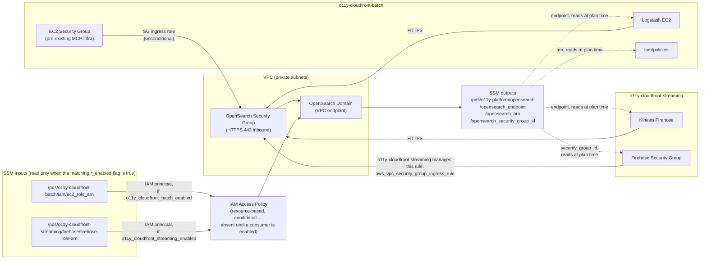
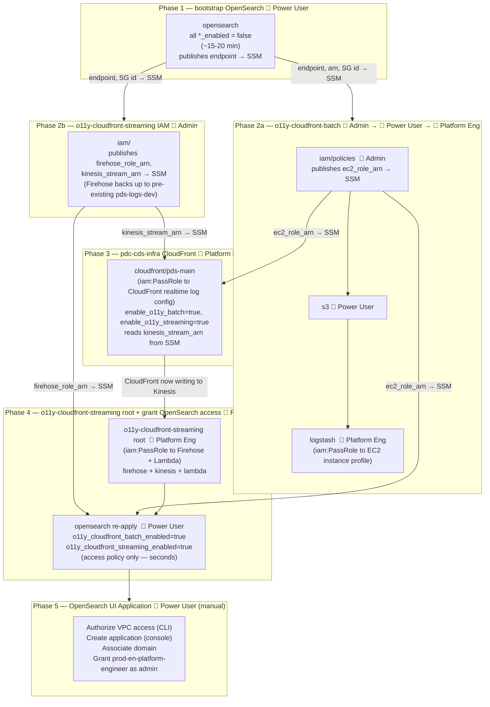

# PDS o11y-platform — Terraform

Deploys the shared observability infrastructure for the NASA Planetary Data System. Consumers connect via SSM — no cross-repo Terraform dependencies.

## Technical architecture



Network access is controlled by Security Group ingress rules (port 443). The EC2 SG rule lives here, since the MCP EC2 SG is pre-existing shared infra; the Firehose SG rule is instead created and owned by o11y-cloudfront-streaming itself, as a separate `aws_vpc_security_group_ingress_rule` resource targeting this repo's SG by ID (read from SSM) — this repo no longer takes a Firehose SG ID as an input. API access is controlled by an IAM resource-based policy whose principals are role ARNs read from SSM at plan time, gated by the `o11y_cloudfront_batch_enabled` / `o11y_cloudfront_streaming_enabled` flags (see [Access control](#access-control)) so the domain can bootstrap before any consumer exists. The domain's endpoint, ARN, and security group ID are published to SSM after deploy; consumers read them at Terraform plan time (dashed lines) with no shared state between repos.

**Ops access** is via the AWS-hosted [OpenSearch UI Application](#opensearch-ui-application) — not the built-in `/_dashboards` endpoint. See that section for setup steps.

## Required AWS permissions

Three access tiers are used across the full deployment. A given principal must have the highest tier required by all modules they deploy.

| Tier | Who | Required when |
|---|---|---|
| **Admin** | Ops/Admin SSO role with `iam:CreateRole` | Any IAM *creation* module — `iam/` submodules in consumer repos |
| **Platform Engineer** | SSO role with `iam:PassRole` (but not `CreateRole`) | Any module that assigns an IAM role ARN to a non-IAM AWS resource (Firehose, Lambda, EC2 instance profile, CloudFront realtime log config) |
| **Power User** | Standard `Project-Power-User` SSO | Everything else — OpenSearch bootstrap, S3, Kinesis, CloudWatch, SSM reads |

> `iam:PassRole` is **not** the same as `iam:CreateRole`. Modules that only *read* a role ARN from SSM and *assign* it to a service resource require PassRole but not CreateRole — these are Platform Engineer, not Admin.

## Deployment flow



1. **(1) Bootstrap OpenSearch** 👤 **Power User** — `task apply VENUE=dev COMPONENT=o11y-platform/opensearch` with all `*_enabled = false` (~15-20 min). Publishes endpoint, ARN, and SG ID to SSM. No IAM creation or role-passing at this phase.
2. **(2a/2b) Deploy in parallel** — both can start immediately after Phase 1:
   - **(2a) o11y-cloudfront-batch**: three sequential steps, each with a different access tier:
     - `iam/policies` — 🔐 **Admin** (`iam:CreatePolicy`, `iam:AttachRolePolicy`; publishes `ec2_role_arn` to SSM)
     - `s3` — 👤 **Power User** (creates `pds-dev-gh01dc-web-analytics` bucket)
     - `logstash` — 🔑 **Platform Engineer** (`iam:PassRole` to EC2 instance profile)
   - **(2b) o11y-cloudfront-streaming `iam/`** — 🔐 **Admin** (`iam:CreateRole` for Firehose/Lambda/CloudFront roles). Publishes `firehose_role_arn` and `kinesis_stream_arn` to SSM. Stop here — don't deploy the root module yet.
3. **(3) pdc-cds-infra CloudFront** — 🔑 **Platform Engineer** — deploy `cloudfront/pds-main` with `enable_o11y_batch = true` and `enable_o11y_streaming = true`. Requires `iam:PassRole` because `aws_cloudfront_realtime_log_config` accepts a `role_arn` for CloudFront→Kinesis delivery. Reads `ec2_role_arn` and `kinesis_stream_arn` from SSM.
4. **(4) o11y-cloudfront-streaming root + grant OpenSearch access** — 🔑 **Platform Engineer** / 👤 **Power User**:
   - **o11y-cloudfront-streaming root** — 🔑 **Platform Engineer** (`iam:PassRole` for `aws_kinesis_firehose_delivery_stream` and `aws_lambda_function`). Firehose reads from Kinesis → OpenSearch, backs up to `pds-logs-dev`.
   - **opensearch re-apply** — 👤 **Power User** — `task apply VENUE=dev COMPONENT=o11y-platform/opensearch` with `o11y_cloudfront_batch_enabled = true` and `o11y_cloudfront_streaming_enabled = true` set in the terragrunt inputs. Access-policy-only update, completes in seconds.
5. **(5) OpenSearch UI Application** — 👤 **Power User** (manual) — see [OpenSearch UI Application](#opensearch-ui-application) for the full sequence. Grant `prod-en-platform-engineer` as the application admin.

**Two log buckets:**
- **`pds-logs-dev`** — pre-existing, managed by pdc-cds-infra. Receives CloudFront standard access logs and Firehose S3 backups.
- **`pds-dev-gh01dc-web-analytics`** — created by o11y-cloudfront-batch `s3`. Receives PDS node access logs read by Logstash.

No manual URL values or `aws ssm put-parameter` seeding required — everything is SSM-driven via `*_enabled` flags.

---

## Prerequisites

- [Terragrunt](https://terragrunt.gruntwork.io/docs/getting-started/install/) >= 0.55
- [Task](https://taskfile.dev) — `brew install go-task/tap/go-task`
- A local checkout of `cds-infra-deploy` — all Terragrunt inputs (vpc_id, subnet IDs, feature flags, etc.) live there as `venues/<venue>/o11y-platform/opensearch/terragrunt.hcl`
- AWS credentials exported:
  ```bash
  eval $(aws configure export-credentials --profile <your-profile> --format env)
  unset AWS_PROFILE  # required for Terraform S3 backend compatibility
  ```

No local tfvars files are needed — all variables are managed as Terragrunt inputs in `cds-infra-deploy`.

---

## Deployment

All commands below run from a checkout of `cds-infra-deploy`. Replace `dev` with the target venue.

### Phase 1 — Bootstrap OpenSearch 👤 Power User (~15-20 min)

```bash
task plan  VENUE=dev COMPONENT=o11y-platform/opensearch
task apply VENUE=dev COMPONENT=o11y-platform/opensearch
```

Publishes endpoint, ARN, and SG ID to SSM — no consumers enabled yet.

### Phase 2a — o11y-cloudfront-batch (sequential, three access tiers)

```bash
# 🔐 Admin
task plan  VENUE=dev COMPONENT=o11y-cloudfront-batch/iam/policies
task apply VENUE=dev COMPONENT=o11y-cloudfront-batch/iam/policies

# 👤 Power User
task plan  VENUE=dev COMPONENT=o11y-cloudfront-batch/s3
task apply VENUE=dev COMPONENT=o11y-cloudfront-batch/s3

# 🔑 Platform Engineer
task plan  VENUE=dev COMPONENT=o11y-cloudfront-batch/logstash
task apply VENUE=dev COMPONENT=o11y-cloudfront-batch/logstash
```

### Phase 2b — o11y-cloudfront-streaming IAM 🔐 Admin (parallel with 2a)

`o11y-cloudfront-streaming/iam` reads `/pds/pdc-cds-infra/s3/pds-logs-bucket-arn` from SSM at plan time. This parameter is published by `pdc-cds-infra/cloudfront/pds-main` (Phase 3) — but since `pds-logs-<venue>` is a pre-existing bucket, seed it manually first:

```bash
VENUE=dev   # set to your target venue

aws ssm put-parameter \
  --name "/pds/pdc-cds-infra/s3/pds-logs-bucket-arn" \
  --value "arn:aws:s3:::pds-logs-${VENUE}" \
  --type String \
  --region us-west-2
```

Then deploy:

```bash
task plan  VENUE=dev COMPONENT=o11y-cloudfront-streaming/iam
task apply VENUE=dev COMPONENT=o11y-cloudfront-streaming/iam
```

Stop here — do not deploy the streaming root module yet. Phase 3 (CloudFront) will overwrite the SSM parameter with the same value via Terraform.

### Phase 3 — pdc-cds-infra CloudFront 🔑 Platform Engineer

```bash
task plan  VENUE=dev COMPONENT=pdc-cds-infra/cloudfront/pds-main
task apply VENUE=dev COMPONENT=pdc-cds-infra/cloudfront/pds-main
```

### Phase 4 — o11y-cloudfront-streaming root + re-enable OpenSearch consumers

```bash
# 🔑 Platform Engineer
task plan  VENUE=dev COMPONENT=o11y-cloudfront-streaming
task apply VENUE=dev COMPONENT=o11y-cloudfront-streaming

# 👤 Power User — flip o11y_cloudfront_batch_enabled and o11y_cloudfront_streaming_enabled
# to true in cds-infra-deploy venues/<venue>/o11y-platform/opensearch/terragrunt.hcl first
task plan  VENUE=dev COMPONENT=o11y-platform/opensearch
task apply VENUE=dev COMPONENT=o11y-platform/opensearch
```

### Phase 5 — OpenSearch UI Application 👤 Power User (manual)

See [OpenSearch UI Application](#opensearch-ui-application) below.

---

## Access control

Principals are read from SSM at plan time, each gated by a Terragrunt input flag so this repo can bootstrap before any consumer exists.

| Terragrunt input flag | SSM path (read only when flag is `true`) | Published by |
|---|---|---|
| `o11y_cloudfront_batch_enabled` | `/pds/o11y-cloudfront-batch/iam/ec2_role_arn` | o11y-cloudfront-batch `iam/policies` module |
| `o11y_cloudfront_streaming_enabled` | `/pds/o11y-cloudfront-streaming/firehose/firehose-role-arn` | o11y-cloudfront-streaming `iam/` module |

Both default to `false`. With both false, `aws_opensearch_domain_policy` isn't created at all — an access policy with an empty `Principal.AWS` is invalid. The flags are independent; flip each as soon as the matching consumer is ready. See [Deployment flow](#deployment-flow) for the full sequence.

---

## OpenSearch UI Application

The **OpenSearch UI Application** is a separately AWS-hosted web UI — distinct from the built-in `/_dashboards` endpoint. It connects to the VPC-only domain without requiring a public endpoint, supports multiple data sources and workspaces, and is the ops access path for this platform. IAM Identity Center is not enabled in PDS accounts; this uses IAM auth instead (IAM role ARNs granted directly as admins).

> **No Terraform resource exists yet** — `aws_opensearch_application` is tracked in [hashicorp/terraform-provider-aws#45082](https://github.com/hashicorp/terraform-provider-aws/issues/45082). All steps below are manual (console + CLI). Run after Phase 4 is complete.

> **Access tier:** 👤 **Power User** for all steps below.

### Step 1 — Authorize VPC access (CLI)

After the domain exists, authorize the OpenSearch UI service to reach it through the VPC:

```bash
aws opensearch authorize-vpc-endpoint-access \
  --domain-name <domain-name> \
  --service application.opensearchservice.amazonaws.com \
  --region us-west-2
```

This is a one-time authorization per domain. To verify:

```bash
aws opensearch list-vpc-endpoint-access \
  --domain-name <domain-name> \
  --region us-west-2
```

### Step 2 — Create the application (console)

1. Open **Amazon OpenSearch Service → OpenSearch UI (Dashboards) → Create application**
2. Enter an **Application name** (e.g., `pds-<venue>-o11y-ui`)
3. Leave the **Authentication with IAM Identity Center** box **unchecked** (not enabled in PDS accounts)
4. Under **OpenSearch application admins**, choose **Grant administrator's permission to specific user(s)**
5. Select **IAM users** and add the `prod-en-platform-engineer` IAM role ARN (and any other ops roles)
6. Choose **Create**

### Step 3 — Associate the OpenSearch domain

1. On the application detail page, choose **Manage data sources**
2. Select the `pds-<venue>-o11y` domain
3. Choose **Next → Save**

The **Launch Application** button activates once at least one data source is associated.

### Step 4 — Grant ops roles domain access

With IAM auth, the application passes the caller's IAM identity to the domain. Add each ops IAM role ARN to `local.opensearch_access_principals` in `opensearch/main.tf` (same pattern as the consumer flags) and apply, so those roles can query the domain through the application.

---

## Teardown

```bash
cd /path/to/cds-infra-deploy
task destroy VENUE=dev COMPONENT=o11y-platform/opensearch   # destroys all indexed data — irreversible
```

---

## Architecture notes

- **State** — S3 backend, key `o11y-platform/opensearch.tfstate`.
- **VPC/SG values** are Terragrunt inputs in `cds-infra-deploy`. TODO: source EC2 SG from SSM under `/pds/cds-infra/vpc/security_groups/` once MCP publishes it.
- **Adding a new consumer** — publish its role ARN to SSM, add a `data "aws_ssm_parameter"` block in `opensearch/main.tf`, add the ARN to the access policy principals, and add an SG ingress rule if needed.
